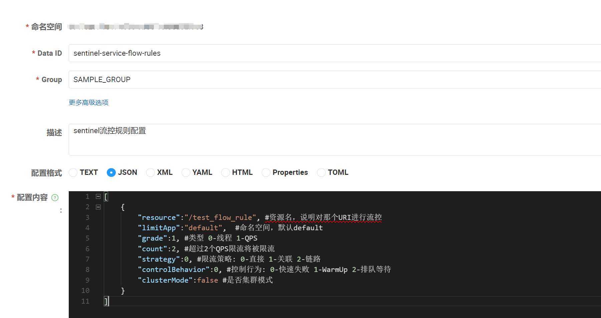

#### docerk 部署 sentinel

1. 拉取镜像

```shell
docker pull bladex/sentinel-dashboard
```

2. 运行镜像

```shell
docker run --name sentinel -d -p 8858:8858 -d bladex/sentinel-dashboard
```

#### sentinel规则存储到nacos，配置文件示例

